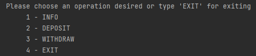
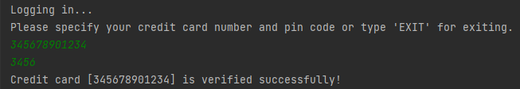
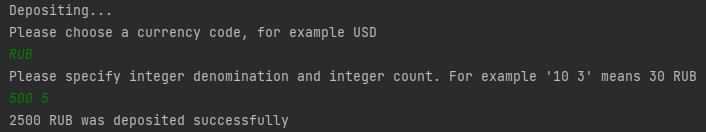
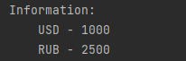
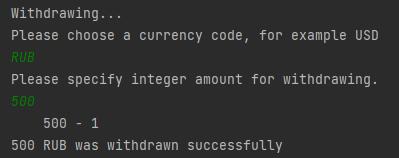
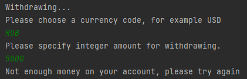
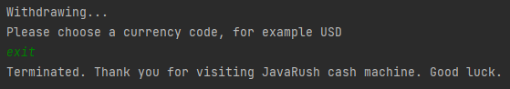

<h1 align="center">ATM simulator</h1>

---

ATM console simulator.      
Use numbers to navigate into the program.       

##Functions

###1. Login
   
Enter the card number and pin code.        
(The data is in the file "src/java/com/lavrus/atm/resources/verifiedCards.properties").     

###2. Deposit money:

To deposit money enter the short currency code, specify denomination and integer count of money.     
The funds will be added to your account.        

###3. Info:

You can check your account balance.     

###4. Withdraw:

To withdraw cash, specify the currency code, then the desired amount.       
If there are enough funds in the account in the specified currency, the operation will be completed successfully.       
     
Otherwise, a notification will be displayed about the absence of the specified amount,      
and you will be asked to enter it again.        

###5. Exit:

To terminate the program enter "exit" at any time of it's work.     

